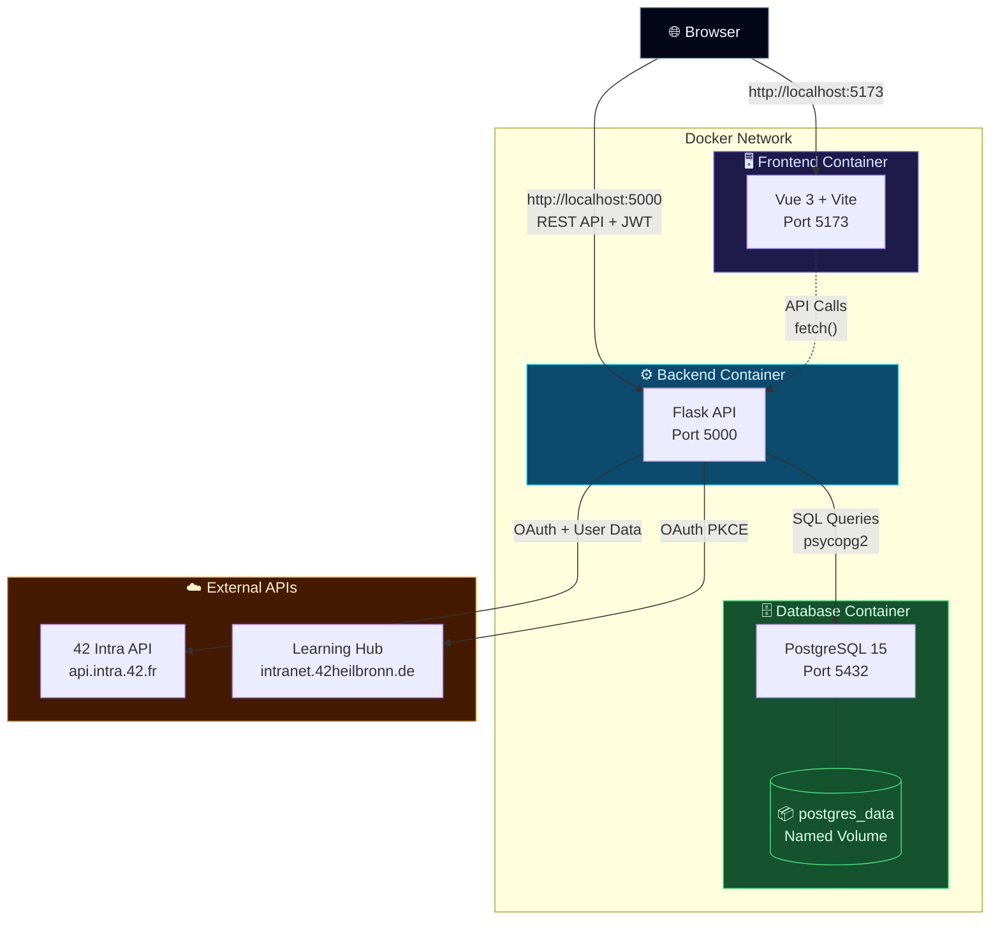
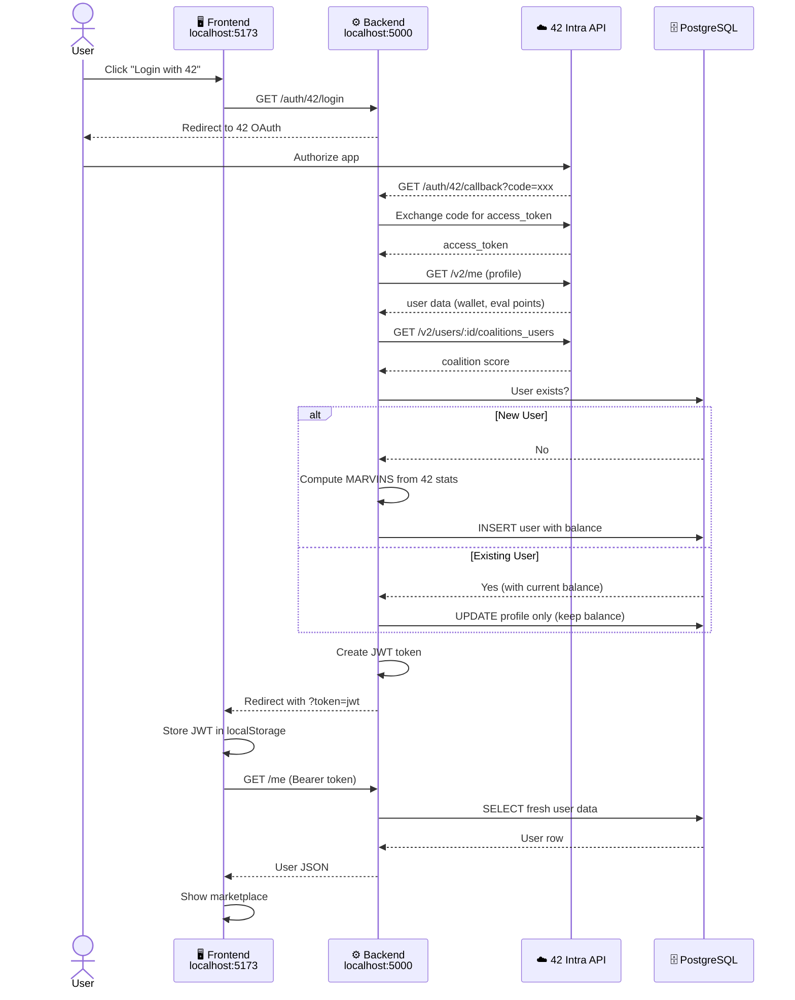
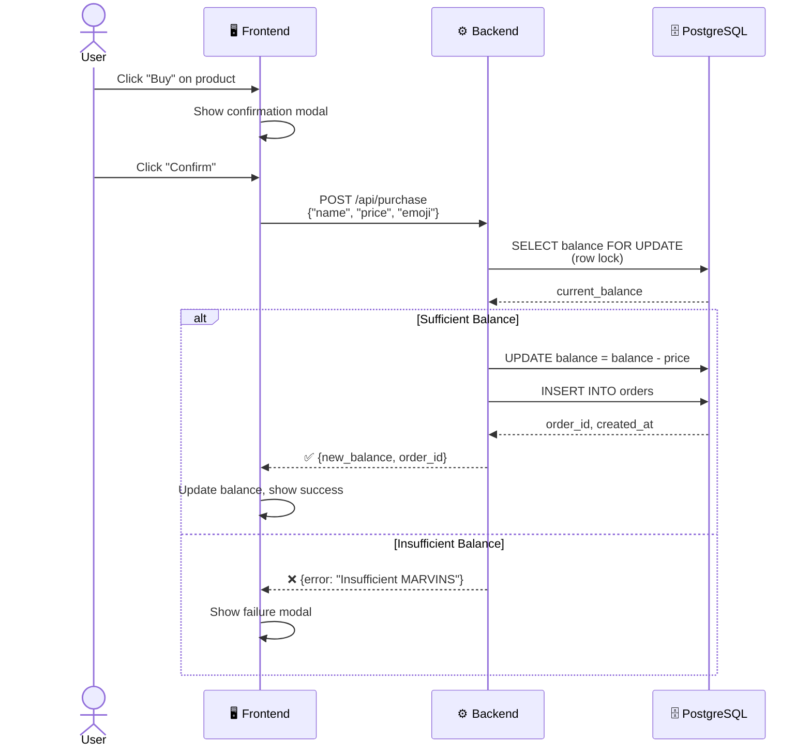
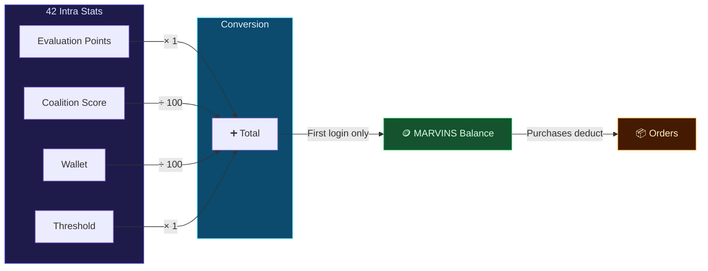
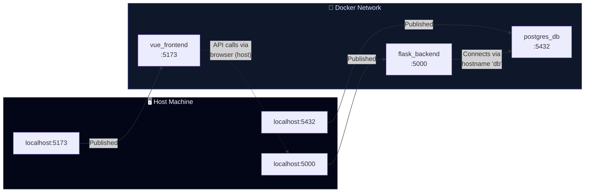

# buildTHEshop
A full-stack virtual marketplace built for 42 students, where campus perks and privileges can be purchased using **MARVINS** — a virtual currency derived from your 42 Intra stats.

Your evaluation points, wallet, coalition score, and threshold from learning hub are automatically converted into MARVINS the first time you log in. Spend them wisely on perks like skipping the eval queue, reserving a desk, or getting your meme featured on campus screens.


## Setup

1. Clone the repo
2. Copy the  env sample and fill in your credentials:

3. .env sample
```
POSTGRES_USER=postgres
POSTGRES_PASSWORD=your_strong_password_here
POSTGRES_DB=hackathondb

FORTYTWO_CLIENT_ID=your_42_client_id
FORTYTWO_CLIENT_SECRET=your_42_client_secret
FORTYTWO_REDIRECT_URI=http://localhost:5000/auth/42/callback

LEARNINGHUB_CLIENT_ID=your_learninghub_client_id
LEARNINGHUB_CLIENT_SECRET=your_learninghub_client_secret
LEARNINGHUB_REDIRECT_URI=http://localhost:5000/auth/learninghub/callback

FRONTEND_URL=http://localhost:5173
APP_SECRET=your_random_secret_key_here

```

4. Start the app:
```bash
docker compose up --build
```

5. Open http://localhost:5173

## System Design

### Container Architecture



### Authentication Flow



### Purchase Flow



### MARVINS Conversion



### Docker Compose Port Mapping

